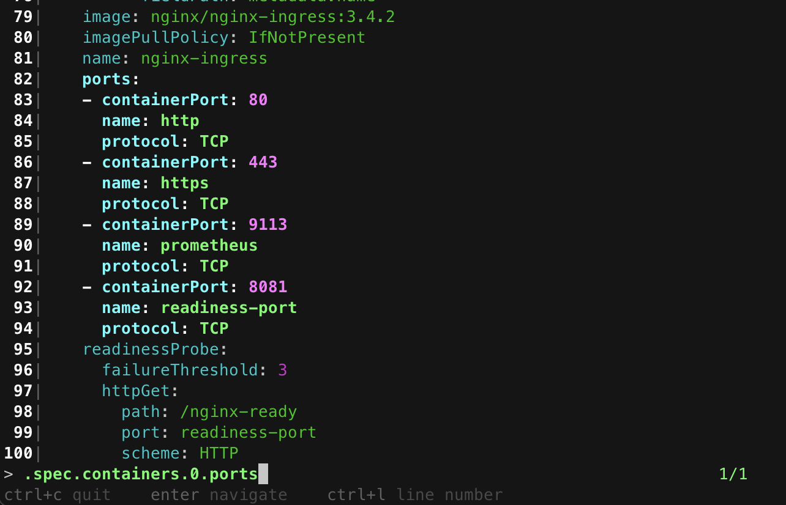

# yn

`yn` (yaml navigator) is a command-line utility tool crafted for exploration of extensive and multi-documented yaml data. It navigates and highlights the part of the data you are seeking, making it an ideal choice for handling large data in yaml format. Featuring dynamic navigation, it allows seamless traversal through a yaml structures, even when you don't know the path of fields. It also offers autocompletion for field paths.

It is mainly designed to simplify the process of working with Kubernetes manifest yaml files.

## Installation

```bash
go install github.com/semihbkgr/yn@latest
```

## Usage

The data is supplied through `stdin`.

```bash
$ cat data.yaml | yn
```

type the path to navigate `.person.address.city`

`ctrl+l` to display line numbers

makes it easy to explore multi-doc outputs of helm templates.

```bash
$ helm template my-release oci://ghcr.io/nginxinc/charts/nginx-ingress | yn
```


